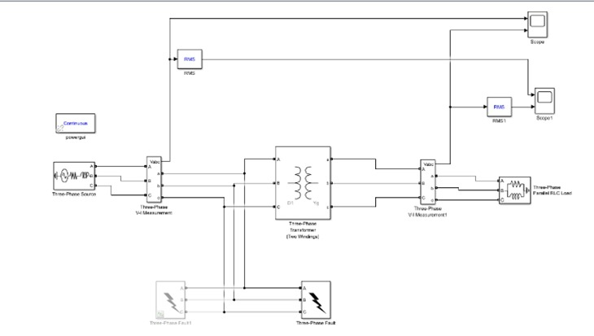

# Voltage_Sag_Model
This project offers a comprehensive analysis of voltage sag characterization and mitigation in power distribution networks using MATLAB and Simulink. By simulating various symmetrical and asymmetrical fault scenarios, the research identifies critical parameters such as sag magnitude, duration, and phase-angle jumps that impact the stability of sensitive industrial equipment. The study utilizes a theoretical voltage divider model to analyze sag propagation through transformer windings and evaluates the performance of a Dynamic Voltage Restorer as an effective solution for maintaining a stable voltage supply. Authored by Anmol Saxena at Galgotias College of Engineering and Technology, this work bridges the gap between theoretical power quality research and practical industrial simulation.

# Voltage Sag Characteristics & Mitigation in Power Distribution Systems
> **Authors:** Mr. Anmol Saxena, Dr. Richa, Dr. Rahul Vivek Purohit

## 1. Project Overview
This project provides a comprehensive analysis of **Voltage Sag Characterization (VSC)** and mitigation in power distribution networks using **MATLAB and Simulink**. By simulating various symmetrical and asymmetrical fault scenarios, the research identifies critical parameters such as sag magnitude, duration, and phase-angle jumps that impact the stability of sensitive industrial equipment. 

The study utilizes a theoretical **voltage divider model** to analyze sag propagation through transformer windings and evaluates the performance of a **Dynamic Voltage Restorer (DVR)** as an effective solution for maintaining a stable voltage supply.

## 2. Publication & Recognition
This work is based on academic research conducted at **Galgotias College of Engineering and Technology**.
* **Research Paper:** "Voltage Sag Characteristics in Power Distribution Systems under Fault Conditions"
* **Institution:** Department of Electronics & Communication Engineering
* **Full Text:** [Link to PDF in /publication folder]
* **Certification:** Official recognition of publication from the institution

## 3. Technical Specifications
* **Software:** MATLAB, Simulink, Simscape Electrical
* **Source Configuration:** 11 kV, 30 MVA, 50 Hz three-phase voltage source
* **Transformer:** Delta/Wye configuration (11 kV/0.4 kV, 1 MVA) to study sag propagation
* **Fault Types:** Single-line-to-ground, Double-line-to-ground, Line-to-line, and Three-phase faults

## 4. Mathematical Model
The project utilizes the voltage divider rule to calculate the voltage at the **Point of Common Coupling (PCC)**:

$$V_{pcc} = V_s \times \frac{Z_f}{Z_s + Z_f}$$

## 5. Visual System Overview
To provide immediate technical context without needing MATLAB, key model architectures and waveforms are included below:

### **System Architecture**

*Figure: Complete Simulink block diagram for the 11 kV feeder line fault model.*

### **Results & Waveform Analysis**

*Figure: Comparative RMS analysis of voltage sags during simulated fault events.*

## 6. Repository Structure
To maintain industrial documentation standards, this repository is organized as follows:
* **/model**: Contains the `.slx` MATLAB Simulink model file.
* **/publication**: Full-text research paper (PDF) and publication certificate.
* **/visuals**: High-resolution screenshots of the model and comparative results.

---
**License:** This project is released under the **MIT License**.
